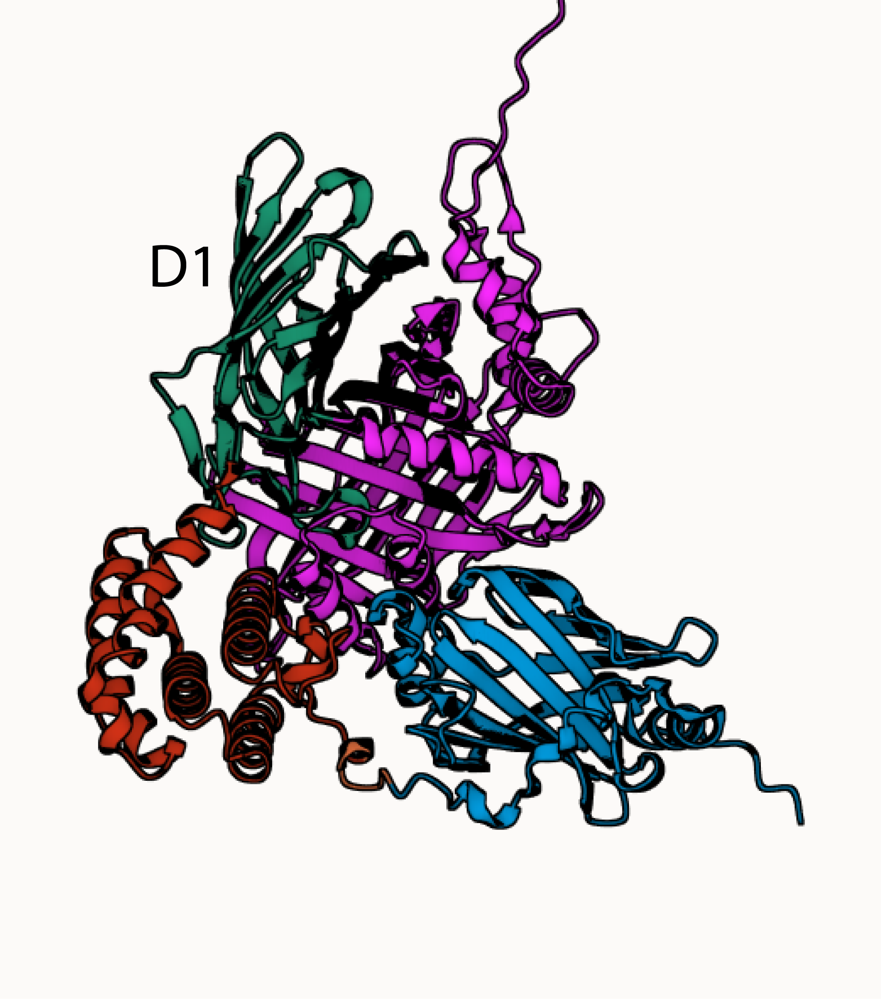

============
Gian's note
```python
from rotifer.devel.beta import sequence as rdbs
from rotifer.devel.alpha import rodolfo as rdar
#Fetch sequence from a fasta file:
protein = rdbs.sequence('./data/leifabp.fa')
#Fetching homologous unis blast:
blast = rdar.psiblast(protein, aln=False)
#Fetching proteins at the uniprot50 DB to collect AF models
af = rdar.psiblast(protein, aln=False,db='/databases/fadb/uniprot/uniref50')
```


PDB file of the A0A1E1J6B3 AF model edited at [Mol Star](https://molstar.org)

### Alinhamento do Domino BB1
[D1](../data/BB1.html)


|    Header 1    |      Header2  |
| ---    | ---    |
| fdsfad |        |
|        | fsd    |
| fdsf   | fsddfs |
|        |        |
| fdsf   | fds    |
|        |        |
|        |        |
|        |        |
|        |        |
|        |        |
|        |        |
|        |        |
|        |        |
|        |        |
|        |        |
